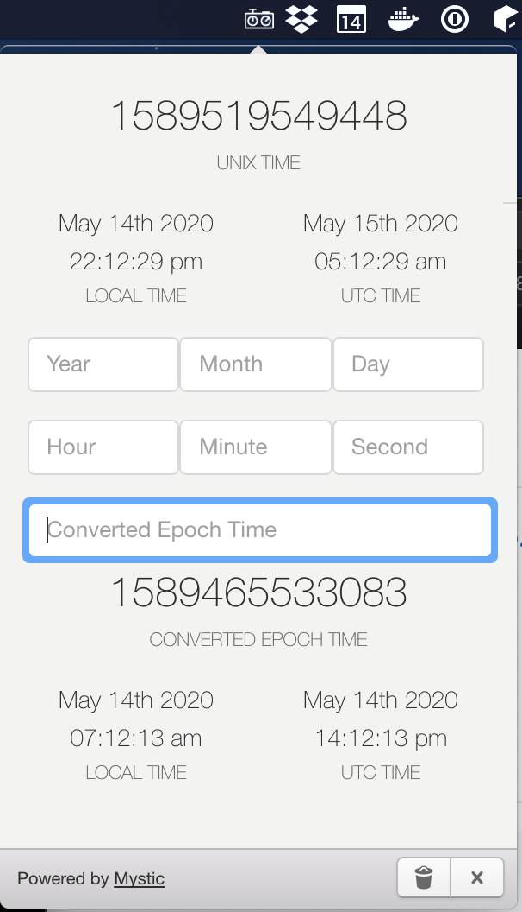
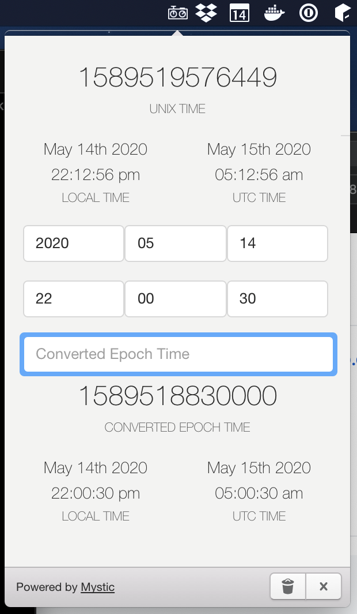

# Mystic Millis

A tool to convert between millisecond time (epoch time) and your local time. Has various mechanisms for copying and hopefully generally being useful for the few among us who deal in milliseconds constantly.

Rapidly built by the team at [Mystic Coders](https://mysticcoders.com).

Built with [Electron](http://electron.atom.io) and [photon](http://photonkit.com).

## Running

```sh
git clone https://github.com/mysticcoders/mysticmillis
cd mysticmillis
npm install
npm start
```

## Packaging
By default we package as darwin.
```sh
npm run package
open out/Mystic Millis-darwin-x64/Mystic Millis.app
```

### Darwin
```sh
npm run package:darwin
open out/Mystic Millis-darwin-x64/Mystic Millis.app
```

### Linux
```sh
npm run package:linux
./out/Mystic Millis-linux-x64/Mystic Millis
```

## How to use

1. The unix time at the top is always going to be the most up to date unix time. 
   1. If you click on the time it will copy the value to your clipboard
2. The left and right displays are your local time and the utc time respectively.
   1. If you click on the local time on the left, it will copy those values into the Year/Month/Day Hour/Minute/Second fields below for you
3. If you have an epoch time and you'd like to know what date it represents locally or in UTC, simply enter into the field "Converted Epoch Time"
4. The epoch time below that text field has a click and copy to clipboard feature as well.

Please open a ticket if you are looking for any enhancements, or find any bugs.

## Sample Screens

The screens below show some of what the tool looks like. And yes, the icon sucks and we'll try to make a better one happen soon.






### Special Thanks

The framework of this copied from an Electron tray example from @kevinsawicki (https://github.com/kevinsawicki/tray-example)
